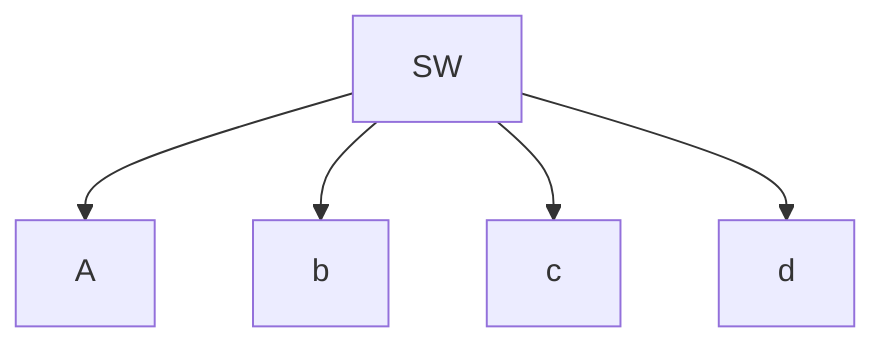

### HOW MANY TYPE OF EMAIL ARE THERE 
- mail servers 
- agent 
- protocol (how to send and receive mail )
 - mail belong to the appication layer of the OSI
 - DNS BELONG [[application layer]]
 - IP BELONG [[network]]
 - mail is use on the public cloud 
## three main components 
- user agents 
- mail servers 
- simple mail transfer protocol : Smtp 
	- a protocol between mail server to send mail 
## smtp 
### three phases of tranfer 
- SMTP handshaking (greeting)
- SMTP transfer of messages 
- SMTP CLOSURE 
### USES TCP TO RELIABLY TRANSFER EMAIL MESSAGE 
### command /response interaction (like HTTP)
- command : ASCII text 
- response : status code and phrase 

let say we have 4 computer 

sw is a router if you want to hack into computer a to d we can overide the router  network so that the defalut gate way is our own 

Computer 
Storage 
Networking 
these are the three primary component of data center 

capex and opex 
opex is buy how many do how many 

disaster recovery is made to recover data the best  